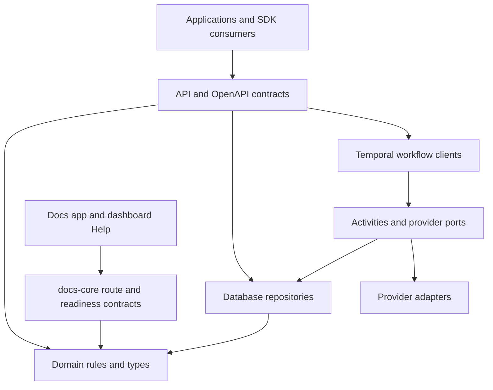

# Tixkit Architecture

This file is the concise map for contributors. The canonical detailed views are [contributor architecture](docs/public/contributing/architecture.mdx) and [self-hosting architecture](docs/public/self-hosting/architecture.mdx).

## Repository boundary

The public `tixkithq/tixkit` repository is authoritative for shared product code, contracts, integration packages and the complete Self-Hosted runtime. Proprietary Cloud operations, managed integrations and natural-language agent orchestration live in the separate private `tixkithq/tixkit-cloud` repository, which consumes immutable public releases. Public code and CI must never depend on private source.

## Runtime applications and services

- `apps/admin-dashboard`: authenticated Next.js operator experience.
- `apps/checkout`: buyer-facing Next.js checkout and public event surfaces.
- `apps/docs`: self-hostable Next.js documentation product and local search index.
- `apps/sdk-*-demo`: executable integration contracts for supported SDKs.
- `packages/api`: Fastify HTTP runtime, authentication, permission checks, validation, and serialization.
- `packages/workflows`: Temporal workers, workflows, activities, and provider orchestration.

PostgreSQL is the primary local relational database. Repository adapters also cover declared compatible database modes. Redis supports runtime coordination, Temporal persists durable execution, and S3-compatible storage owns generated or uploaded artifacts.

## Package boundaries

Dependencies point inward through explicit contracts:

`packages/domain` owns pure business rules and stable types. `packages/db` owns migrations and repositories. HTTP concerns stay in `packages/api`; durable orchestration stays in `packages/workflows`. Provider transport, content rendering/editor, UI utility, SDK, widget, and documentation contracts stay in their named packages. Applications compose packages but do not become shared libraries.

## Request flow and isolation

An HTTP request is authenticated, resolved to a tenant principal, authorized for its scopes, validated, and then dispatched to a repository or durable workflow. Tenant, organization, and brand identifiers are carried explicitly. Repositories and services must enforce those boundaries; accepting an unscoped identifier from a browser is not authorization.

Browser applications receive public configuration and scoped response data only. Database credentials, provider credentials, API keys, and webhook signing secrets remain in server or worker processes. One-time credentials are not placed in URLs, analytics, logs, or persistent browser storage.

## Checkout and inventory

Checkout validates the event, sales channel, products, ticket types, prices, and availability before creating durable state. Inventory holds prevent overselling while payment is pending. Temporal coordinates expiration, payment/provider work, finalization, ticket delivery, and recovery. Activities perform external I/O; workflows remain deterministic. Repository transactions enforce the final database invariants.

## OpenAPI, SDKs, and documentation

`packages/openapi` is the public HTTP contract. Stable operation IDs and schemas feed the generated API reference. SDK public exports, API-version statements, snippets, demos, dashboard client types, and public docs must change in the same slice as a contract change. Validation detects drift between those surfaces.

`packages/docs-core` owns canonical documentation route IDs, Help registry entries, search contracts, SDK snippet metadata, and shared readiness types. `docs/public` is the public content source. Private planning and operational evidence belong outside this repository.

## Providers and failure boundaries

Payment, messaging, authentication, storage, and other integrations sit behind provider ports. Provider adapters translate external failures into typed internal outcomes and must not bypass tenant checks. API health, worker health, provider health, and delivery health are separate signals; one successful surface does not imply every dependency is ready.

## Observability

The API, workers, workflows, and provider adapters emit structured logs, metrics, and traces with correlation context. Sensitive values and payloads are redacted. Operational guidance lives under `docs/public/operations` and `docs/public/self-hosting`.

## Public source boundary

This repository is the authoritative public source for shared product code and the complete Self-Hosted runtime. The private Cloud repository consumes immutable public artifacts and cannot introduce same-repository managed dependencies or maintain a private fork of shared source.
