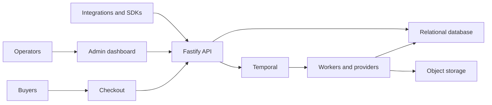

# Tixkit

Tixkit is a headless, white-label event commerce platform. It combines event and inventory management, checkout, ticket delivery, check-in, messaging, webhooks, and supported SDKs without forcing operators into one storefront.

## What is included

- An authenticated operator dashboard and buyer-facing checkout.
- A Fastify API with an OpenAPI contract and tenant-scoped authorization.
- Durable Temporal workflows for inventory, checkout, delivery, exports, and provider work.
- JavaScript and framework SDKs, mobile SDKs, a checkout widget, and runnable demos.
- A self-hostable documentation application with local search.

## Architecture



The concise boundary map is in [ARCHITECTURE.md](ARCHITECTURE.md). Contributor and deployment detail lives in the [public documentation](docs/public/contributing/architecture.mdx).

## Five-minute local quickstart

Requirements: Bun 1.3+, Node.js 20+, Docker with Compose, and the ports listed in the [local quickstart](docs/public/getting-started/local-quickstart.mdx).

```bash
bun install --frozen-lockfile
cp .env.local.example .env.local
bun run setup:check -- --mode local
bun run quickstart -- --no-open
```

The quickstart starts infrastructure, applies migrations, runs the API, worker, checkout, dashboard, and documentation applications, then seeds repeatable sample data. It stays in the foreground so one Control-C can stop its managed processes.

Verify these surfaces:

| Surface              | URL                            | Expected state             |
| -------------------- | ------------------------------ | -------------------------- |
| API                  | `http://localhost:4000/health` | Successful health response |
| Dashboard            | `http://localhost:3001`        | Operator application loads |
| Checkout             | `http://localhost:3000`        | Buyer application loads    |
| Documentation        | `http://localhost:3002`        | Documentation home loads   |
| Documentation health | `http://localhost:3002/health` | Successful health response |
| Temporal UI          | `http://localhost:8080`        | Local namespace is visible |

For recovery steps and manual alternatives, use the [tested local quickstart](docs/public/getting-started/local-quickstart.mdx).

## Build an integration

Start with [your first event](docs/public/getting-started/first-event.mdx), then make a [safe first API call](docs/public/getting-started/first-api-call.mdx). The generated [API reference](docs/public/reference/api/index.mdx) and [webhook event catalog](docs/public/reference/webhook-events.mdx) are the contract references.

Supported guide coverage includes JavaScript, Next.js, SvelteKit, Vue/Nuxt, Astro, Remix, React Native, Flutter, iOS, Android, Go, and Rust. Choose a guide under [docs/public/sdks](docs/public/sdks); runnable framework and mobile examples live under `apps/sdk-*-demo`.

Never put a Tixkit API key or webhook signing secret in browser code. Keep credentials in server-only environment variables and use the framework's server adapter or route handler.

## Self-host and operate

Start with the [self-hosting architecture](docs/public/self-hosting/architecture.mdx), [configuration reference](docs/public/self-hosting/configuration.mdx), and [deployment guide](docs/public/self-hosting/deployment.mdx). Operational runbooks cover Temporal, incidents, backups, observability, upgrades, and provider configuration.

The documentation app is part of the workspace:

```bash
bun run dev:docs
bun run docs:check
bun run docs:build
```

It uses a local search index by default and does not require a hosted search service.

## Contribute and get help

Read [CONTRIBUTING.md](CONTRIBUTING.md) before changing contracts or public behavior. Use [SUPPORT.md](SUPPORT.md) for support routing, [SECURITY.md](SECURITY.md) for vulnerability reporting, and [CODE_OF_CONDUCT.md](CODE_OF_CONDUCT.md) for community expectations. Product direction is summarized in [ROADMAP.md](ROADMAP.md).

## License

Tixkit is licensed under the [MIT License](LICENSE). This repository is the authoritative public source for the complete Self-Hosted runtime and public integration packages. The separate proprietary `tixkithq/tixkit-cloud` repository consumes immutable public releases and does not own or fork shared product source.
